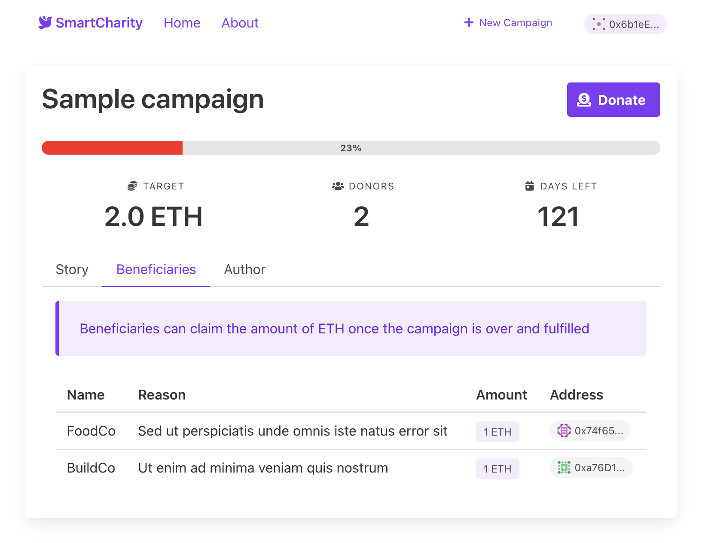

[](https://app.netlify.com/sites/smart-charity/deploys)

# smart-charity

Decentralized crowdfunding platform for charity campaigns aiming at transparent collection and distribution of cryptocurrency donations.

## Overview

This repo includes Solidity smart contracts compatible with EVM-based blockchains, and responsive single-page application written in Vue.

It's built using standard and secure smart contract library [OpenZeppelin](https://github.com/OpenZeppelin/openzeppelin-contracts) vetted by the awesome community.


**Smart Contracts**

* Crowdfunding Campaign
* Smart Charity Token
* Campaign Wallet
* Campaign Factory

⚠️ Smart contracts are not audited. Please do not use in production!

**Client App**



## Develop

1. Install Truffle globally.
    ```javascript
    npm install -g truffle
    ```

2. Run the development console.
    ```javascript
    truffle develop
    ```

3. Compile and migrate the smart contracts. Note inside the development console we don't preface commands with `truffle`.
    ```javascript
    compile
    migrate
    ```

4. Run the front-end with hot reloading (outside the development console). Smart contract changes must be manually recompiled and migrated.
    ```javascript
    // Serves the front-end on http://localhost:8080
    cd app
    npm run serve
    ```

Find more at the official [Truffle docs](https://www.trufflesuite.com/docs).

## Next

* Accept ERC-20 stablecoins for donations
* Governance using SCT
